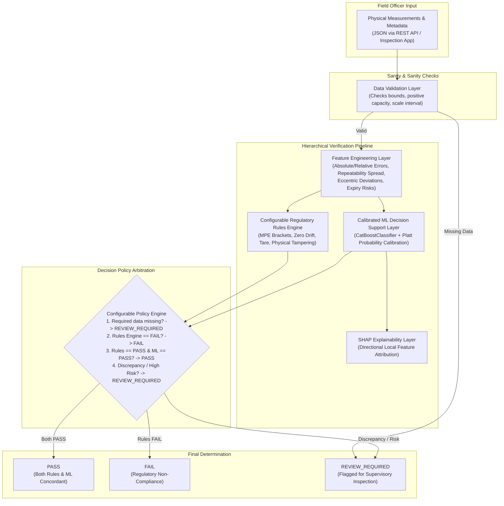

# Legal Metrology ML Verification Engine

[](https://www.python.org/)
[](https://fastapi.tiangolo.com/)
[](https://catboost.ai/)
[](https://shap.readthedocs.io/)
[]()

A standalone, production-oriented Machine Learning Verification Engine for a Legal Metrology weighing-instrument verification and certification platform.

> [!IMPORTANT]
> **CRITICAL LEGAL & ENGINEERING PRINCIPLE:**  
> In Legal Metrology, machine learning **is not** the legal authority. The system architecture enforces a strict hierarchy:  
> `Physical Measurements → Regulatory Rules Engine → ML Prediction Layer → Configurable Decision Policy → Final Determination`.  
> A high-confidence ML `PASS` **can never override** a regulatory rules-engine `FAIL`.

---

## Table of Contents
1. [Project Purpose](#1-project-purpose)
2. [Architecture](#2-architecture)
3. [Why CatBoost Was Selected](#3-why-catboost-was-selected)
4. [Why Random Forest Is Used as Baseline](#4-why-random-forest-is-used-as-baseline)
5. [Feature List](#5-feature-list)
6. [Dataset Generation](#6-dataset-generation)
7. [Training Pipeline](#7-training-pipeline)
8. [Evaluation & Metrology Safety Metrics](#8-evaluation--metrology-safety-metrics)
9. [SHAP Explainability](#9-shap-explainability)
10. [Configurable Regulatory Rules Engine](#10-configurable-regulatory-rules-engine)
11. [REST API Endpoints](#11-rest-api-endpoints)
12. [Example Request](#12-example-request)
13. [Example Response](#13-example-response)
14. [How to Run](#14-how-to-run)
15. [How to Retrain](#15-how-to-retrain)
16. [How to Replace Synthetic Data with Real Validated Data](#16-how-to-replace-synthetic-data-with-real-validated-data)
17. [Model Limitations](#17-model-limitations)
18. [Legal & Regulatory Limitations](#18-legal--regulatory-limitations)
19. [Data Privacy Considerations](#19-data-privacy-considerations)
20. [Production Deployment Considerations](#20-production-deployment-considerations)

---

## 1. Project Purpose
Authorized Legal Metrology field officers physically inspect, test, and calibrate weighing and measuring instruments across commercial trade, industries, transport, and laboratories. The manual verification form captures:
- Instrument metadata (type, manufacturer, model, capacity, scale interval)
- Accuracy readings across three load stages
- Repeatability series (multiple observations at half-capacity)
- Eccentric loading tests (center and quadrant loads)
- Zero drift and tare test errors
- Sensitivity tests
- Physical condition, display status, tampering indicators, and verification seal integrity
- Historical maintenance and certificate validity

Rather than requiring an officer to manually select `PASS` or `FAIL` (which introduces subjective bias, human error, or inconsistent interpretation), this standalone ML engine automatically analyzes structured physical verification data. It provides:
1. Deterministic regulatory compliance checking via a rules engine.
2. Calibrated ML risk scoring and confidence estimations.
3. Feature attribution explanations via SHAP.
4. An arbitrated decision output (`PASS`, `FAIL`, or `REVIEW_REQUIRED`).

---

## 2. Architecture



---

## 3. Why CatBoost Was Selected
`CatBoostClassifier` was chosen as the primary production model for several metrological reasons:
- **Mixed Categorical & Numerical Tabular Data:** Inspection records contain diverse categorical metadata (instrument type, accuracy class, manufacturer, seal condition) alongside high-precision floating-point physical measurements.
- **Native Categorical Encoding:** CatBoost handles high-cardinality and low-cardinality categories using Ordered Target Statistics without causing target leakage or requiring extensive manual one-hot dimensionality explosion.
- **Robustness to Missing Values:** In field inspections, optional tests (e.g. sensitivity or tare for certain classes) may be omitted; CatBoost natively routes missing values through optimal tree split paths.
- **Resilience to Overfitting:** Symmetric trees (oblivious decision trees) act as a strong regularizer, critical when working with small to medium-sized verification batches.
- **Fast CPU Inference:** Requires no GPU hardware, executing sub-millisecond predictions suitable for handheld field terminals and edge devices.

---

## 4. Why Random Forest Is Used as Baseline
`RandomForestClassifier` (from `scikit-learn`) was implemented as the baseline benchmark:
- **Established Tabular Standard:** Non-parametric bagging ensemble serving as an industry-standard baseline for structured tabular data.
- **Decoupled Architecture:** Evaluated on the exact same cross-validation and test partitions with standardized ordinal encoding.
- **Comparative Safety Benchmarking:** Allows explicit performance comparisons on Accuracy, F1, ROC-AUC, and specifically **False PASS Rate**.

---

## 5. Feature List

### Identification & Metadata
- `instrument_type`: One of 7 supported instrument classes.
- `manufacturer`, `model`: Instrument hardware pedigree.
- `accuracy_class`: OIML R76 accuracy class (`I`, `II`, `III`, `IIII`).
- `capacity`: Maximum weighing capacity (kg).
- `scale_interval`: Verification scale interval $e$ (kg).
- `instrument_age_years`: Elapsed device operational lifetime.
- `previous_verifications`, `previous_failures`, `repair_count`: Historical maintenance record.
- `last_verification_days_ago`: Time elapsed since preceding verification.

### Physical Measurements
- **Accuracy Loads:** `reference_load_1`, `observed_reading_1`, `error_1` (~10% capacity); `reference_load_2`, `observed_reading_2`, `error_2` (~50% capacity); `reference_load_3`, `observed_reading_3`, `error_3` (~100% capacity).
- **Repeatability:** `repeatability_reading_1` through `repeatability_reading_5` at 50% capacity.
- **Eccentric Loading:** `center_reading`, `front_left_reading`, `front_right_reading`, `back_left_reading`, `back_right_reading` at ~33% capacity.
- **Zero Test:** `initial_zero`, `final_zero`, `zero_drift`.
- **Tare Test:** `tare_reference`, `tare_observed`, `tare_error`.
- **Sensitivity Test:** `sensitivity_test_load`, `sensitivity_indication_change`, `sensitivity_error`.

### Physical Inspection & Documentation
- `physical_condition`: Structural state (`Good`, `Fair`, `Worn`, `Severely Damaged`, `Critical Corrosion`).
- `display_condition`, `display_functioning`: Legibility of numerical readouts.
- `seal_condition`: Verification seal status (`Intact`, `Verified`, `New Seal Applied`, `Broken`, `Missing`, `Tampered`).
- `tampering_indicator`: Binary flag indicating suspicious mechanical or electronic alteration.
- `previous_certificate_available`, `previous_certificate_valid`, `certificate_expired_days`.

### Engineered Features
- `absolute_error_1`, `absolute_error_2`, `absolute_error_3`: Magnitude of accuracy discrepancies.
- `relative_error_1`, `relative_error_2`, `relative_error_3`: Ratio of error to applied load.
- `maximum_absolute_error`, `mean_absolute_error`, `maximum_relative_error`.
- `repeatability_range`: Max reading spread across repeatability repetitions.
- `repeatability_std`: Repeatability standard deviation.
- `eccentric_range`, `eccentric_max_deviation`: Maximum deviation of any quadrant from center.
- `zero_drift_absolute`, `tare_error_absolute`.
- `instrument_age_bucket`: Categorical risk bracket (`< 1 year`, `1 - 3 years`, etc.).
- `historical_failure_rate`: $\frac{\text{previous\_failures}}{\text{previous\_verifications}}$.
- `certificate_expiry_risk`: Normalized risk score based on expiration duration.

---

## 6. Dataset Generation
The synthetic dataset generator (`src/data/generate_dataset.py`) models realistic physical measurements across **7 distinct instrument types**:
1. Electronic Weighing Machine
2. Mechanical Weighing Machine
3. Weighbridge / Truck Scale
4. Crane / Hanging Scale
5. Counting Scale
6. Price Computing Scale
7. Precision / Analytical Balance

### Synthetic Realism & Controlled Noise
- **Physically Realistic Parameters:** Capacities, scale intervals, and loads are constrained by typical metrological ranges (e.g. analytical balances operate in grams/fractions, weighbridges in metric tonnes).
- **Rule-Based Ground Truth with Controlled Noise:** Labels are calculated via the `RegulatoryRulesEngine` and injected with a controlled ~4% noise rate to mirror real-world borderline conditions and inspector subjectivity.
- **CLI Commands:**
  ```powershell
  python src/data/generate_dataset.py --seed 42 --rows 10000 --output data/synthetic/synthetic_verifications.csv
  ```

---

## 7. Training Pipeline
The training pipeline (`scripts/train.py`):
1. Loads and validates raw dataset records.
2. Performs automated feature engineering.
3. Partitions data into **Train (70%)**, **Validation (15%)**, and **Test (15%)** sets.
4. **Data Leakage Prevention:** Supports grouped stratification by `instrument_id` (`StratifiedGroupKFold`), preventing an instrument's multi-year records from leaking across splits.
5. Fits `MetrologyDataPreprocessor` and trains both `CatBoostClassifier` and `RandomForestClassifier`.
6. Calibrates probabilities on the validation set using **Platt Scaling (Sigmoid)**.
7. Evaluates both models and computes explicit safety metrics.
8. Fits `shap.TreeExplainer` and outputs global feature importance figures.
9. Exports model bundle to `models/`.

---

## 8. Evaluation & Metrology Safety Metrics

In legal metrology, a **False PASS** (certifying a defective or fraudulent scale) is vastly more dangerous than a **False FAIL** (requiring an honest merchant to recalibrate). The system explicitly evaluates and prints:

$$\text{False PASS Rate (FPR)} = \frac{\text{Actual FAILs predicted as PASS}}{\text{Total Actual FAILs}}$$

$$\text{False FAIL Rate (FFR)} = \frac{\text{Actual PASSes predicted as FAIL}}{\text{Total Actual PASSes}}$$

### Evaluated Metrics:
- Accuracy, Precision, Recall, F1 Score
- ROC-AUC and PR-AUC
- Confusion Matrix (TN, FP, FN, TP)
- **False PASS Rate (Must be minimized)**
- **False FAIL Rate**
- **Composite Metrology Safety Score:** $\text{F1} \times (1 - \text{False PASS Rate})$

---

## 9. SHAP Explainability
`src/explainability/shap_explainer.py` leverages `shap.TreeExplainer` to provide:
1. **Global Feature Importance:** Identifies overarching factors driving model predictions across the population.
2. **Local Instance Attribution:** For each inspected instrument, extracts top factors pushing towards `FAIL` vs. `PASS`, categorizing impact as `HIGH`, `MEDIUM`, or `LOW`.

> [!WARNING]
> **LEGAL NOTICE ON EXPLAINABILITY:**  
> SHAP feature attributions represent statistical model sensitivity. They **must not** be cited as legal reasoning or statutory causes for refusal. Legal refusal must cite specific regulatory sections and exceeded MPE values.

---

## 10. Configurable Regulatory Rules Engine
The rules engine (`src/rules/rules_engine.py`) operates from `config/rules_config.yaml`.

### Permissible Error (MPE) Calculation:
$$m = \frac{\text{Load}}{\text{Scale Interval } (e)}$$
Error tolerances are determined by accuracy class ($I, II, III, IIII$) brackets and instrument modifiers.

### Sub-test Evaluations:
1. `physical_inspection_result`: Checks seals, corrosion, tampering.
2. `accuracy_result`: Checks error 1, 2, 3 against MPE.
3. `repeatability_result`: Checks reading spread against repeatability MPE.
4. `eccentric_result`: Checks quadrant deviation from center.
5. `zero_result`: Checks zero drift against $0.5 \times e$.
6. `tare_result`: Checks tare error against tare MPE.
7. `sensitivity_result`: Checks indication change against sensitivity threshold.

Result: `PASS`, `FAIL`, or `REVIEW_REQUIRED`.

---

## 11. REST API Endpoints

| Method | Endpoint | Description |
|---|---|---|
| `GET` | `/health` | Service health, model load status, version. |
| `GET` | `/model/info` | Architecture, benchmark metrics, calibration method. |
| `POST` | `/validate` | Validates input physical bounds and regulatory checks. |
| `POST` | `/predict` | Complete decision-support prediction with rules + ML + SHAP. |
| `POST` | `/explain` | Returns detailed local SHAP feature attributions. |

---

## 12. Example Request

`POST /predict`
```json
{
  "instrument_type": "Electronic Weighing Machine",
  "manufacturer": "Avery India",
  "model": "AVE-300",
  "accuracy_class": "III",
  "capacity": 30.0,
  "scale_interval": 0.005,
  "instrument_age_years": 2.0,
  "previous_verifications": 2,
  "previous_failures": 0,
  "repair_count": 0,
  "last_verification_days_ago": 360,
  "reference_load_1": 3.0,
  "observed_reading_1": 3.001,
  "reference_load_2": 15.0,
  "observed_reading_2": 15.002,
  "reference_load_3": 30.0,
  "observed_reading_3": 30.003,
  "repeatability_reading_1": 15.000,
  "repeatability_reading_2": 15.001,
  "repeatability_reading_3": 15.001,
  "center_reading": 10.000,
  "front_left_reading": 10.001,
  "initial_zero": 0.0,
  "final_zero": 0.001,
  "seal_condition": "Intact",
  "tampering_indicator": false,
  "display_functioning": true
}
```

---

## 13. Example Response

```json
{
  "prediction": "PASS",
  "confidence": 0.96,
  "risk_score": 0.04,
  "rules_engine_result": "PASS",
  "final_result": "PASS",
  "model_version": "1.0.0",
  "decision_note": "Instrument compliant with regulatory rules and validated by decision support model.",
  "rule_violations": [],
  "explanation": [
    {
      "feature": "maximum_absolute_error",
      "impact": "low",
      "direction": "supports_pass",
      "observed_value": 0.003,
      "shap_value": -0.8421
    },
    {
      "feature": "eccentric_max_deviation",
      "impact": "low",
      "direction": "supports_pass",
      "observed_value": 0.001,
      "shap_value": -0.4120
    }
  ],
  "request_id": "7f9a12c8-508b-4a57-8149-1662d5854b73"
}
```

---

## 14. How to Run

### Step 1: Install Requirements
```powershell
pip install -r requirements.txt
```

### Step 2: Train Model & Generate Artifacts
```powershell
python scripts/train.py --rows 10000 --seed 42
```

### Step 3: Run Interactive Sample Predictions
```powershell
python scripts/predict_sample.py --input data/synthetic/sample_verification.json
```

### Step 4: Launch FastAPI Service
```powershell
python -m uvicorn src.api.main:app --host 0.0.0.0 --port 8000 --reload
```
Interactive Swagger UI is available at `http://localhost:8000/docs`.

### Step 5: Run Automated Tests
```powershell
python -m pytest tests -v
```

---

## 15. How to Retrain
To retrain with updated hyperparameter configurations or a new dataset:
```powershell
python scripts/train.py --data path/to/new_dataset.csv --config config/model_config.yaml
```

---

## 16. How to Replace Synthetic Data with Real Validated Data
1. Export historical verification logs from your production Legal Metrology database.
2. Format the export to match the schema defined in `config/feature_config.yaml`.
3. Set `dataset_type: "FIELD_HISTORICAL"`.
4. Run dataset validation to audit anomalies:
   ```powershell
   python -c "import pandas as pd; from src.data.validate_dataset import validate_dataset_dataframe; df = pd.read_csv('real_data.csv'); clean, report = validate_dataset_dataframe(df); print(report)"
   ```
5. Ensure `group_by_instrument: true` in `config/model_config.yaml` to prevent data leakage across repeated inspections of the same physical devices.
6. Retrain and verify False PASS Rate before certification.

---

## 17. Model Limitations
- **Synthetic Data Disclaimer:** Prototype models trained on synthetic data do not reflect true field calibration deviations.
- **Non-Statutory Decisions:** The ML layer is an intelligent advisor. Legal determinations must be anchored in the rules engine.
- **Dataset Drift:** Measurement profiles change over seasons, temperature swings, and mechanical wear. Continuous monitoring of input drift is required.
- **False PASS Asymmetry:** Minimizing False PASS is prioritized over raw accuracy.

---

## 18. Legal & Regulatory Limitations
- Prototype MPE values in `config/rules_config.yaml` are demonstration parameters.
- Must be reconciled with the **Legal Metrology Act, 2009**, **Legal Metrology (General) Rules, 2011**, and **OIML R76-1:2006**.
- Legal rejection orders must cite official legal sections and specific measurement tolerances.

---

## 19. Data Privacy Considerations
- Verification records may contain sensitive commercial information (e.g. enterprise scale serials, business locations, high-value precious metal balances).
- Serial numbers and business identifiers should be pseudonymized before model training.
- No personally identifiable information (PII) should be exposed in SHAP explanation outputs.

---

## 20. Production Deployment Considerations
- **Isolated Service:** Keep this ML repository containerized (Docker) behind internal API gateways.
- **Audit Logging:** Maintain immutable transaction logs containing raw inputs, rules results, ML confidence, and request IDs for legal audits.
- **Supervisory Escalation:** Any `REVIEW_REQUIRED` output should automatically route to a senior metrological inspector.
- **Fail-Safe Fallback:** If the ML service is unreachable, the client application must gracefully fall back strictly to the deterministic Regulatory Rules Engine.
